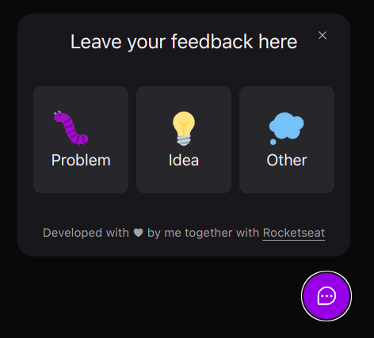

# [NLW Return 2022 - 1 week (React, NodeJS and React Native) promoted by RocketSeat :rocket:](https://www.rocketseat.com.br/)
### What I've put in practice ?

:white_check_mark: React, NodeJS, TailwindCSS and React Native.
:white_check_mark: TypeScript and JavaScript.

## The application

The application is named <strong>FeedGet</strong>, consists in a mini feature that a website could adopt, where it could send a feedback about a subject (Problem, Idea or Other) and the screenshot could be sent together with the feedback to the server.

  

## How the course was taken 

- The code was written during the 5 days of the week following the videos.

## Contacts

To send me an email ➡️ `hericlesbitencourt@icloud.com`
or contact me on  [Linkedin](https://www.linkedin.com/in/hericlesbitencourt/).